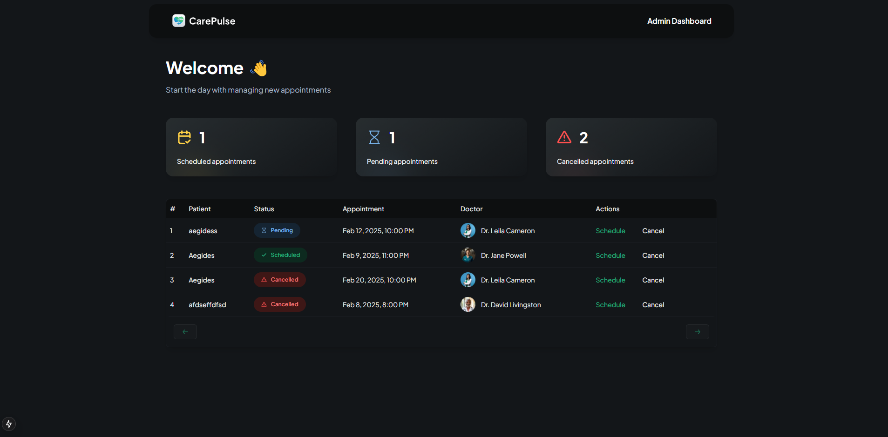

# Introduction
A healthcare patient management application that allows patients to easily register, book, and manage their appointments with doctors, featuring administrative tools for scheduling, confirming, and canceling appointments, all built using Next.js.

# Tech Stack
- Next.js
- Appwrite
- Typescript
- TailwindCSS
- ShadCN

# Features
👉 Register as a Patient: Users can sign up and create a personal profile as a patient.

👉 Book a New Appointment with Doctor: Patients can schedule appointments with doctors at their convenience and can book multiple appointments.

👉 Manage Appointments on Admin Side: Administrators can efficiently view and handle all scheduled appointments.

👉 Confirm/Schedule Appointment from Admin Side: Admins can confirm and set appointment times to ensure they are properly scheduled.

👉 Cancel Appointment from Admin Side: Administrators have the ability to cancel any appointment as needed.

👉 Complete Responsiveness: The application works seamlessly on all device types and screen sizes.

👉 File Upload Using Appwrite Storage: Users can upload and store files securely within the app using Appwrite storage services.

👉 Manage and Track Application Performance Using Sentry: The application uses Sentry to monitor and track its performance and detect any errors.

# Quick Start

Follow these steps to set up the project locally on your machine.

**Prerequisites**

Make sure you have the following installed on your machine:

- [Git](https://git-scm.com/)
- [Node.js](https://nodejs.org/en)
- [npm](https://www.npmjs.com/) (Node Package Manager)

**Cloning the Repository**

```bash
git clone https://github.com/adrianhajdin/healthcare.git
cd healthcare
```

**Installation**

Install the project dependencies using npm:

```bash
npm install
```

**Set Up Environment Variables**

Create a new file named `.env.local` in the root of your project and add the following content:

```env
#APPWRITE
NEXT_PUBLIC_ENDPOINT=https://cloud.appwrite.io/v1
PROJECT_ID=
API_KEY=
DATABASE_ID=
PATIENT_COLLECTION_ID=
APPOINTMENT_COLLECTION_ID=
NEXT_PUBLIC_BUCKET_ID=

NEXT_PUBLIC_ADMIN_PASSKEY=111111
```

Replace the placeholder values with your actual Appwrite credentials. You can obtain these credentials by signing up on the [Appwrite website](https://appwrite.io/).

**Running the Project**

```bash
npm run dev
```

Open [http://localhost:3000](http://localhost:3000) in your browser to view the project.


# Screenshots:
## Patient


## Admin

